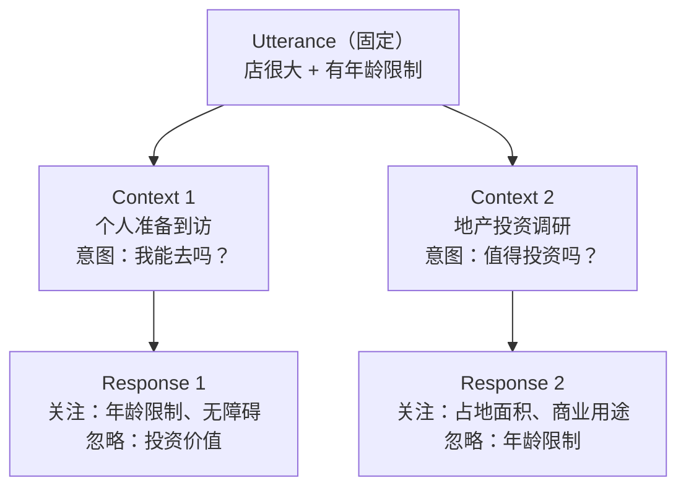

# HumOmni Competition

## Introduction

### Evaluation Tracks

#### Track 1: EmpathyEval

Evaluates how multimodal systems understand human context and paralinguistic cues, and produce appropriate affective spoken responses.

The benchmark includes:
- Context-Variant settings
- Tone-Variant settings

**Inputs include:**
- Textual context
- One speech utterance
- Candidate response audio

**Evaluation metric:** Accuracy

---

## Competition Focus

This competition focuses on the evaluation of empathy. We use an input-output framework to understand how the surrounding conversational context changes, indicating different situations, and the model must determine which candidate response best fits the specific situation.

### Input Structure

Text Context + User Speech Utterance + Candidate Response Audio


### Example

**Utterance:**  
> The store occupies more than an acre of real estate and is not meant for people over a certain age.

**Key information:**
- more than an acre
- is not meant for people over a certain age

---

## Context-Response Examples

### Context 1 (Personal Visit)

**User intent:** A user is asking their AI assistant about a specific store's age restrictions and physical space attributes before planning a visit.

**Response:**  
> It seems like this store is quite spacious and may have age-specific guidelines. Would you like me to find out what age group the store is suitable for or if there's any special accessibility support?

### Context 2 (Real Estate Investment)

**User intent:** A user is investigating potential real estate investment opportunities and needs info on real estate utilization by businesses.

**Response:**  
> This store uses a significant amount of real estate. If you're considering investments in similar properties, you might want to explore businesses ... Would you like more details on businesses that occupy large areas?

### Core Logic Diagram


### Relationship Flow

``` 

┌─────────────────┐
│   Utterance     │
└────────┬────────┘
         ▼
┌─────────────────┐
│    Context      │
└────────┬────────┘
         ▼
┌─────────────────┐
│   Response      │
└─────────────────┘

```

## Key Capabilities Assessed in Context-Variant Tasks (Summary)

| # | Capability | Core Question | Example in This Task |
| --- | --- | --- | --- |
| **1** | **Semantic Disambiguation** | Can the model resolve meaning based on context? | "Age restriction" matters in Context 1 (visit), not in Context 2 (investment) |
| **2** | **Context Tracking & Intent Recognition** | Does the model infer the user's true goal? | Context 1 → wants to visit; Context 2 → wants to invest |
| **3** | **Information Filtering** | Can the model ignore irrelevant information? | Context 2 must ignore "age restriction" |
| **4** | **Response Ranking & Selection** | Does the model choose the best candidate for (Utterance + Context)? | Requires discriminative ability & consistency |
| **5** | **Commonsense Reasoning & Situational Appropriateness** | Does the model produce context-appropriate responses? | Investment inquiry → don't ask about wheelchair access |


