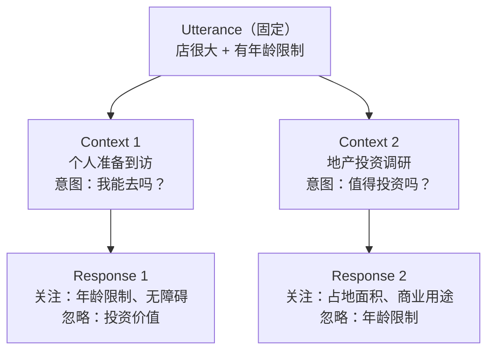
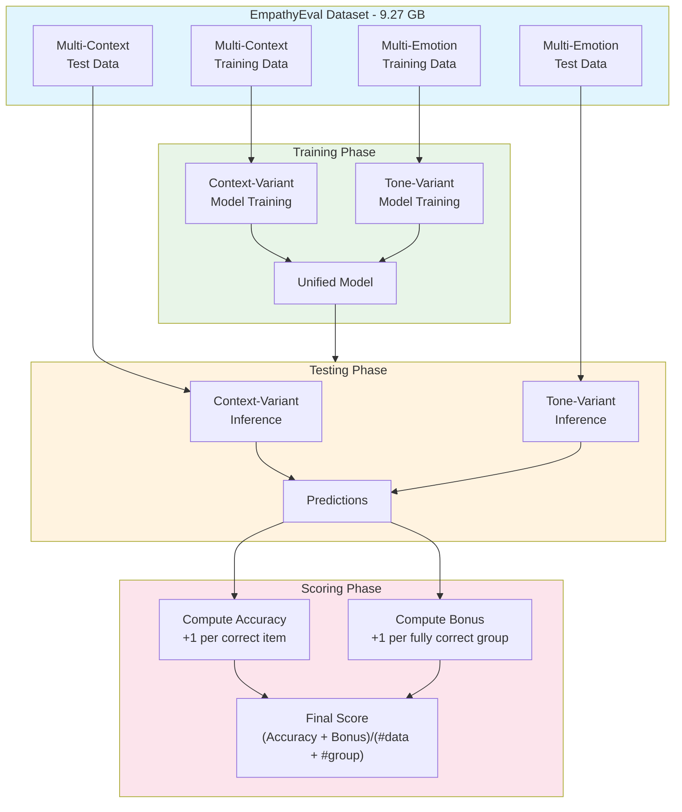

# HumOmni Competition

## Introduction

### Evaluation Tracks

#### Track 1: EmpathyEval

Evaluates how multimodal systems understand human context and paralinguistic cues, and produce appropriate affective spoken responses.

The benchmark includes:
- Context-Variant settings
- Tone-Variant settings

**Inputs include:**
- Textual context
- One speech utterance
- Candidate response audio

**Evaluation metric:** Accuracy

---

## Competition Focus

This competition focuses on the evaluation of empathy. We use an input-output framework to understand how the surrounding conversational context changes, indicating different situations, and the model must determine which candidate response best fits the specific situation.

### Input Structure

Text Context + User Speech Utterance + Candidate Response Audio


### Example

**Utterance:**  
> The store occupies more than an acre of real estate and is not meant for people over a certain age.

**Key information:**
- more than an acre
- is not meant for people over a certain age

---

## Context-Response Examples

### Context 1 (Personal Visit)

**User intent:** A user is asking their AI assistant about a specific store's age restrictions and physical space attributes before planning a visit.

**Response:**  
> It seems like this store is quite spacious and may have age-specific guidelines. Would you like me to find out what age group the store is suitable for or if there's any special accessibility support?

### Context 2 (Real Estate Investment)

**User intent:** A user is investigating potential real estate investment opportunities and needs info on real estate utilization by businesses.

**Response:**  
> This store uses a significant amount of real estate. If you're considering investments in similar properties, you might want to explore businesses ... Would you like more details on businesses that occupy large areas?

### Core Logic Diagram


### Relationship Flow

``` 

┌─────────────────┐
│   Utterance     │
└────────┬────────┘
         ▼
┌─────────────────┐
│    Context      │
└────────┬────────┘
         ▼
┌─────────────────┐
│   Response      │
└─────────────────┘

```

## Key Capabilities Assessed in Context-Variant Tasks (Summary)

| # | Capability | Core Question | Example in This Task |
| --- | --- | --- | --- |
| **1** | **Semantic Disambiguation** | Can the model resolve meaning based on context? | "Age restriction" matters in Context 1 (visit), not in Context 2 (investment) |
| **2** | **Context Tracking & Intent Recognition** | Does the model infer the user's true goal? | Context 1 → wants to visit; Context 2 → wants to invest |
| **3** | **Information Filtering** | Can the model ignore irrelevant information? | Context 2 must ignore "age restriction" |
| **4** | **Response Ranking & Selection** | Does the model choose the best candidate for (Utterance + Context)? | Requires discriminative ability & consistency |
| **5** | **Commonsense Reasoning & Situational Appropriateness** | Does the model produce context-appropriate responses? | Investment inquiry → don't ask about wheelchair access |

## Evaluation Metrics

| Metric | Description |
| --- | --- |
| **Accuracy** | For each correctly predicted item, the accuracy score increases by 1. |
| **Grouped Bonus** | If all items in a context-variant or tone-variant group are predicted correctly, the bonus score increases by 1. |
| **Final Score** | `(Accuracy + Bonus) / (#data + #group)` |

### Calculation Example

Assume:
- `#data = 6` (6 items)
- `#group = 2` (2 groups, 3 items each)

#### Data & Predictions

| Group | Item | Prediction | Ground Truth | Correct |
| --- | --- | --- | --- | --- |
| A | 1 | Response 1 | Response 1 | ✅ |
| A | 2 | Response 1 | Response 2 | ❌ |
| A | 3 | Response 2 | Response 2 | ✅ |
| B | 4 | Response 1 | Response 1 | ✅ |
| B | 5 | Response 2 | Response 2 | ✅ |
| B | 6 | Response 1 | Response 1 | ✅ |

#### Step 1: Compute Accuracy

Each correct item = +1

| Item | Correct | Score |
| --- | --- | --- |
| 1 | ✅ | +1 |
| 2 | ❌ | 0 |
| 3 | ✅ | +1 |
| 4 | ✅ | +1 |
| 5 | ✅ | +1 |
| 6 | ✅ | +1 |

**Accuracy = 1 + 0 + 1 + 1 + 1 + 1 = 5**

#### Step 2: Compute Bonus

Each group with all items correct = +1

| Group | Correct Sequence | All Correct? | Bonus |
| --- | --- | --- | --- |
| A | ✅, ❌, ✅ | No | 0 |
| B | ✅, ✅, ✅ | Yes | +1 |

**Bonus = 0 + 1 = 1**

#### Step 3: Compute Final Score

Final Score = (Accuracy + Bonus) / (#data + #group)
= (5 + 1) / (6 + 2)
= 6 / 8
= 0.75

### Comparison: Impact of One Error

| Scenario | Accuracy | Bonus | Total | Final Score |
| --- | --- | --- | --- | --- |
| Current (Group A has 1 error) | 5 | 1 | 6 | 6/8 = **0.75** |
| If Group A were all correct | 6 | 2 | 8 | 8/8 = **1.00** |

> **Key insight:** One single error can cost **2 points** (1 Accuracy + 1 Bonus), which is equivalent to losing 2 regular items.

### How to Achieve a Higher Score

| Priority | Strategy | Reason |
| --- | --- | --- |
| 1 | Ensure **all items within each group are correct** | Each bonus is worth as much as an entire group of correct items |
| 2 | Prioritize fixing the **weakest item in each group** | The last item in a group determines the bonus |
| 3 | Improve overall Accuracy | Basic score, but marginal value is lower than bonus |

> **Conclusion:** In this formula, getting every item correct within each group is more important than sporadically improving overall accuracy. **Bonus is the key lever for a high score.**

## Dataset Overview

### Data Structure Overview

The EmpathyEval dataset is organized into two main task variants: **Multi-Context** and **Multi-Emotion**.

#### Multi-Context (Context-Variant)

| Field | Type | Description |
| --- | --- | --- |
| `context` | str | Conversation history / surrounding dialogue context |
| `utterance` | str | User's spoken utterance (text transcript) |
| `candidate_responses` | list[str] | Paths or waveforms of candidate response audios |
| `label` | int | Index of the correct response (0-indexed) |
| `group_id` | str | Group identifier for bonus calculation |

#### Multi-Emotion (Tone-Variant)

| Field | Type | Description |
| --- | --- | --- |
| `text` | str | Utterance text content |
| `audio` | str / waveform | Speech audio with paralinguistic tone (pitch, speed, emotion) |
| `candidate_responses` | list[str] | Paths or waveforms of candidate response audios |
| `label` | int | Index of the correct response (0-indexed) |
| `group_id` | str | Group identifier for bonus calculation |

#### Flat JSON Preview

The `*_flat.json` files provide a lightweight, human-readable view of the data structure without loading large pickle files:

```json
{
  "context": "User: I'm planning to visit a new store tomorrow.",
  "utterance": "The store occupies more than an acre of real estate and is not meant for people over a certain age.",
  "candidate_responses": ["response_1", "response_2", "response_3"],
  "label": 0,
  "group_id": "context_group_001"
}
```

### Data Usage by Phase

| Phase | Files | Purpose |
| --- | --- | --- |
| **Training / Validation** | `empatheticDialogue_t_multi-context.zip`<br>`empatheticDialogue_n_multi-emotion.zip` | Model training, hyperparameter tuning, and validation |
| **Data Exploration** | `*_flat.json` | Quick inspection of data schema and content (no need to download GB-level files) |
| **Testing (Phase 1)** | `phase1-test_multi-context_gigaspeech.zip`<br>`phase1-test_multi-context_meld.zip`<br>`phase1-test_multi-emotion_emovdb.zip` | Official evaluation. Labels are hidden; predictions must be submitted. |

### File Role Summary

| File | Size | Format | Role | Phase |
| --- | --- | --- | --- | --- |
| `empatheticDialogue_t_multi-context.zip` | 3.88 GB | pickle | Multi-context training data | Train/Val |
| `empatheticDialogue_t_multi_context_flat.json` | 2.01 MB | JSON | Multi-context data preview | Exploration |
| `empatheticDialogue_n_multi-emotion.zip` | 4.36 GB | pickle | Multi-emotion training data | Train/Val |
| `empatheticDialogue_n_multi-emotion_flat.json` | 1.88 MB | JSON | Multi-emotion data preview | Exploration |
| `phase1-test_multi-context_gigaspeech.zip` | 264 MB | pickle | Multi-context test (GigaSpeech) | Testing |
| `phase1-test_multi-context_meld.zip` | 634 MB | pickle | Multi-context test (MELD) | Testing |
| `phase1-test_multi-emotion_emovdb.zip` | 130 MB | pickle | Multi-emotion test (EmoVDB) | Testing |

### Data Flow Diagram



## Leaderboard

The leaderboard will report context-variant and tone-variant results separately, including **Accuracy / Bonus / Final Score**, together with the weighted average of the final scores.

| Model | Context-variant | Tone-variant | Avg. |
| --- | --- | --- | --- |
| Qwen2.5-Omni-7B (baseline) | 189 / 32 / 0.381 | 60 / 3 / 0.420 | 249 / 35 / 0.389 |
| Qwen2.5-Omni-3B (baseline) | 182 / 31 / 0.367 | 66 / 3 / 0.460 | 248 / 34 / 0.386 |

> **Note:** Public scores will be announced after the evaluation process.

### Score Interpretation

| Score Component | Context-Variant (7B) | Context-Variant (3B) | Tone-Variant (7B) | Tone-Variant (3B) |
| --- | --- | --- | --- | --- |
| Accuracy | 189 | 182 | 60 | 66 |
| Bonus | 32 | 31 | 3 | 3 |
| Final Score | 0.381 | 0.367 | 0.420 | 0.460 |

### Key Observations

| Observation | Details |
| --- | --- |
| **Larger model advantage** | 7B outperforms 3B on context-variant (0.381 vs 0.367) |
| **Tone-variant is harder** | Both models achieve lower Accuracy on tone-variant (~60 vs ~180) |
| **Bonus impact** | Context-variant benefits more from group bonus (32 vs 3) |
| **Tone-variant efficiency** | 3B achieves higher final score on tone-variant (0.460 vs 0.420) |


